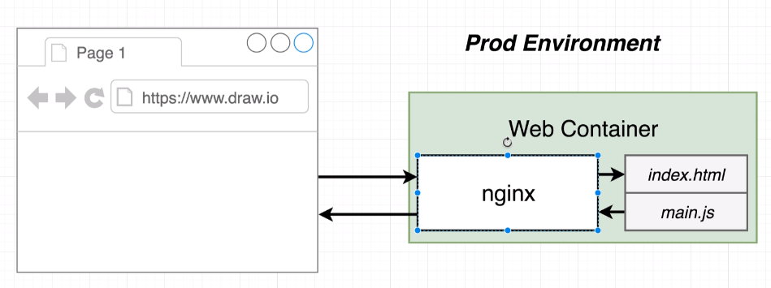
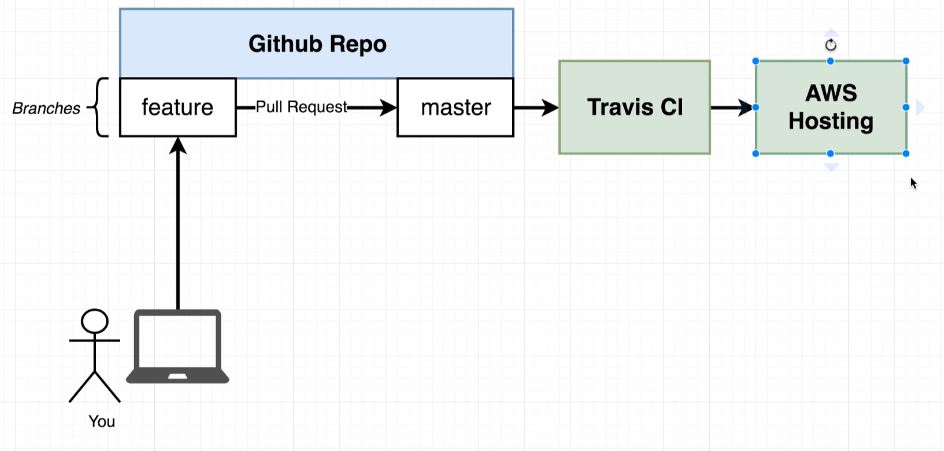

# Workflow D Frontend

Is about the standard create-scaffolded React app that will be containerized, built on Travis CI, pushed to Google Cloud Registry and run inside Google Cloud Run.

## Project's Production Environment Concept

## Project's CI/CD Concept

Notice that AWS Hosting is alternatively done with Google Cloud Run

## Build Commands
