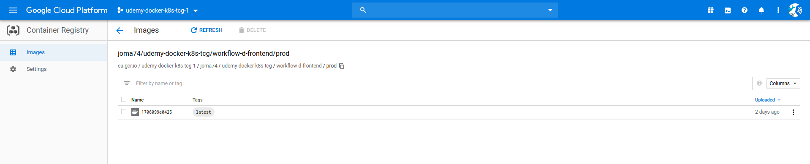

[](https://travis-ci.org/joma74/udemy-docker-k8s-tcg)

# Workflow D Frontend

Is about the standard create-scaffolded React app that will be containerized, built on Travis CI, pushed to Google Cloud Registry and run inside Google Cloud Run.

## Build Commands

dev build command

```sh
docker build -t ${IMAGE_NAME_DEV} -f Dockerfile.dev .
```

dev test command

```sh
docker run -e CI=true "${IMAGE_NAME_DEV}" yarn run test
```

prod build command

```sh
docker build -t "${IMAGE_PROD_ON_REPO}" .
```

# Read All The Good Things For Google Cloud Run

## https://github.com/ahmetb/cloud-run-travisci

Walks you through a build on Travis CI and how to deploy the container to Google Cloud Run(GCR). Most of the instructions are taken and are how i got things done. Else i would hardly been able to complete this route with Google Cloud Run(GCR). For a starter the essential informations are all scattered within the https://cloud.google.com/run/docs.

### Prepare A Google Cloud Run Service

- Register a Google Account, giving permissions to use https://console.cloud.google.com/
- Go to "Cloud Run" from the lefthand menu, then dropdown in the blue bar heading and activate "New project"._(Did take a while to find my way around)_
  - Review your inputs and jot down the **Project Name**.
- Activate "Create Service" in the upper bar.
- As the Container Image URL i chose as container registry the one of `eu.gcr.io` as defined in https://cloud.google.com/container-registry/docs/access-control?hl=de#granting_users_and_other_projects_access_to_a_registry.
- For the rest of the URL you have to plan under what name you will push your Docker Image to that registry. Mind that Docker push provides you to use a given image tag name from your local builds, so you must use a tag name that fully represents the Container Image URL from above e.g. `eu.gcr.io/udemy-docker-k8s-tcg-1/joma74/udemy-docker-k8s-tcg/workflow-d-frontend/prod:latest`. Do not worry if your Docker image is not already at the GCR.
- Select `fully managed`, a Service Name, a Location and `Allow unauthenticated invocations`.
- At the additional options i changed the defaults for Memory allocation to 128MiB and for a Maximum number of instances to 2.
  - Review your inputs and jot down the **Container Image URL**, **Location** and **Service Name**.
- Activate "Create"

### Prepare A Travis Account

- Register a travis-ci.org account by signing in via your Github account, giving permission to access your repos

### Follow the site's instructions

The essentials of what you will be doing are

- Install the Google Cloud SDK locally(see https://cloud.google.com/sdk)
- Login via `gcloud auth login`
- Create a `travisci-deployer` account and assign appropriate permissions with GCR
- Create a JSON key for authenticating `travisci-deployer` when the image will be built in Travis CI. Remember to store the JSON key in a safe place. I think it's nice to have the key inside the local workspace folder - if so think about adding `*-key.json` to your `.gitignore`. So the unencrypted JSON key won't be pushed to your central source repo.
- Install the travis cli

  ```sh
  sudo apt install ruby ruby-dev
  sudo gem install travis
  ```

  I thought about skipping this step, but in a minute you will see why it is temporarily required to do so.

- Login via `travis login --org`
- Encrypt the JSON key for authenticating `travisci-deployer`. This must be done in a very travis-specific way - i pondered if this is a) required and b) secure enough. But anyway, the best and proposed, AFAIK only option to handle a secure key `file!` with Travis CI. Jot down the generated `openssl aes...` command. _P.S. Does something with Github access tokens against your Github account, dunno_
- Now have a look at the [travis.yml](./.travis.yml).
- Configure the environment variables in the ``env:global` section assigning as jotted down
  - GCP_PROJECT_ID your **Project Name**
  - IMAGE_PROD_ON_REPO your **Container Image URL**
  - CLOUD_RUN_REGION your **Location**
  - CLOUD_RUN_SERVICE your **Service Name**
  - CLOUDSDK_CORE_DISABLE_PROMPTS=1

If everything works out, you should see ~

- at your Google Cloud Registry



- at your Google Cloud Run site

TBD pic

- at your then-presented URL

TBD pic

## https://github.com/ahmetb/cloud-run-faq

A complementary site of FAQ to https://cloud.google.com/run/docs.

## https://cloud.google.com/run/docs/reference/container-contract

Especially https://cloud.google.com/run/docs/reference/container-contract#port got me off and made me wonder why. So had to adjust to and crumpy create [gcr.nginx.conf](./gcr.nginx.conf). Okay, my fault, portability reasons, as stated :smiley:

> Listening for requests on PORT
>
> The container _must_ listen for requests on 0.0.0.0 _on the port defined by the PORT environment variable_.
> In Cloud Run container instances, the PORT environment variable _is always set to 8080_, but for portability reasons, your code should not hardcode this value.
