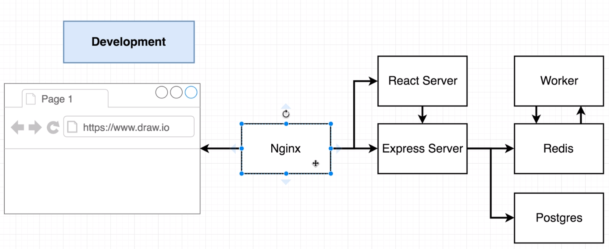
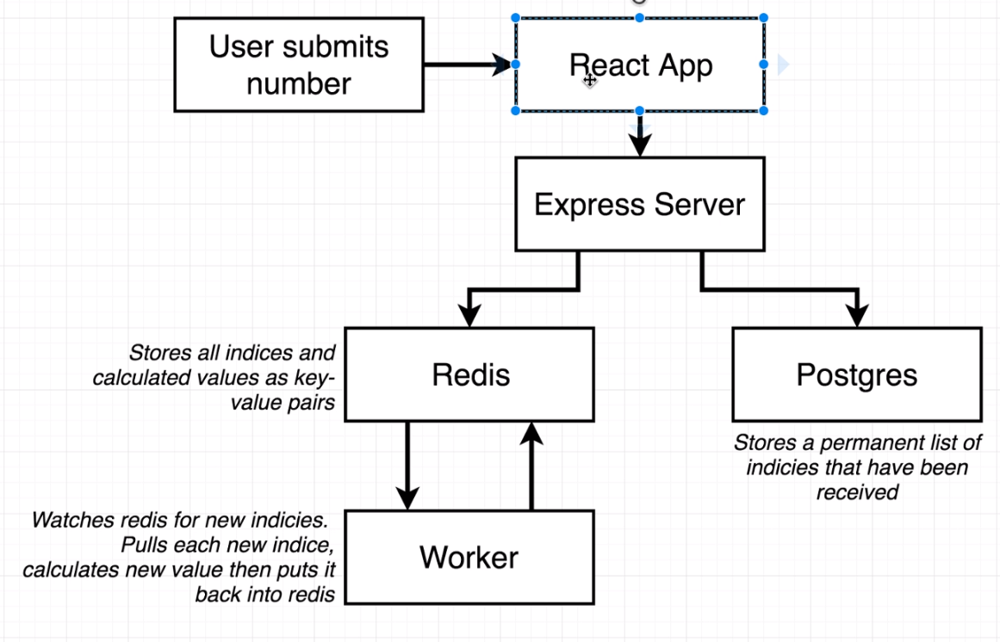

# Fibonacci Calc

TBD

## Project's Development Environment Concept



## Project's Flow Concept



## Project's CI/CD Concept

TBD Pic Project's CI/CD Concept Screenshot

## Build Commands

```sh
docker build -t joma74/udemy-docker-k8s-tcg/fibonacci-calc/frontend -f fibonacci-calc-frontend/Dockerfile.dev fibonacci-calc-frontend/
```

```sh
docker build -t joma74/udemy-docker-k8s-tcg/fibonacci-calc/server -f fibonacci-calc-server/Dockerfile.dev fibonacci-calc-server/
```

```sh
docker build -t joma74/udemy-docker-k8s-tcg/fibonacci-calc/server -f fibonacci-calc-server/Dockerfile.dev fibonacci-calc-server/
```

## Issue Parade

### Uncaught Error: Incompatible SockJS! Main site uses: "1.4.0", the iframe: "1.3.0".

See https://github.com/facebook/create-react-app/issues/7782 for nginx changes, but error persists. Further https://github.com/facebook/create-react-app/pull/7988 should close this up.

## DKK

### Docker logs not showing colors

See https://stackoverflow.com/a/38508869/3274229

> Not quite the answer to this specific problem, but if you're using the debug library and have the same issue there is a non-documented environment variable that enables the colors even when in a non TTY:
> https://github.com/visionmedia/debug/blob/39ecd87bcc145de5ca1cbea1bf4caed02c34d30a/node.js#L45
>
> So adding DEBUG_COLORS=true to your environment variables fixes it for the debug library colors.

```json
"scripts": {
    "start": "DEBUG_COLORS=true DEBUG=* node src/index.js",
    ...
},
```

### NPM debug - Use Log Message Parameter Substitution Formatters

See

- https://www.npmjs.com/package/debug#formatters
- https://nodejs.org/api/util.html#util_util_format_format_args
