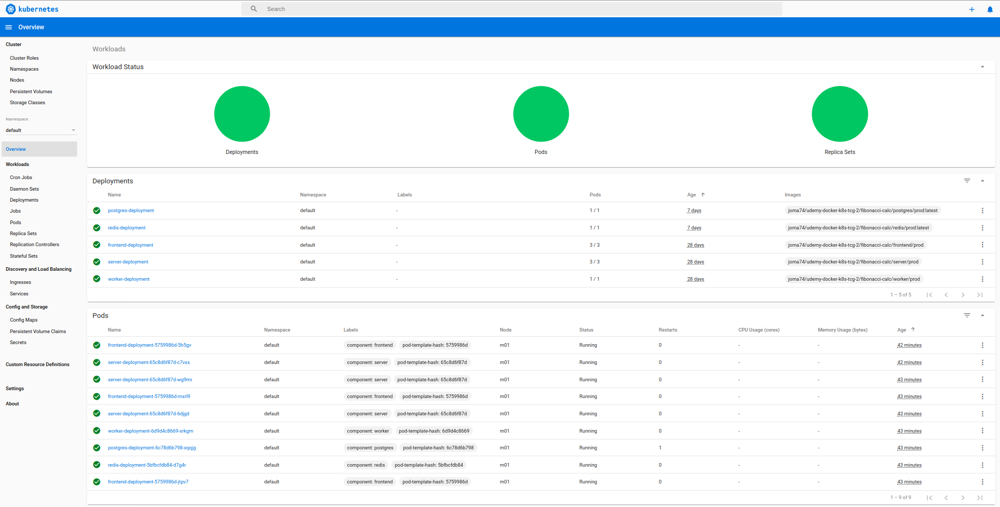

# Fibonacci Calc


## DISCLAIMER


_PLEASE NOTE THAT THIS Fibonacci Calc APPLICATION AS PER THE COURSE HAS SERIOUS IMPLEMENTATION LIMITATIONS AND FLAWS. THESE WERE NOT FIXED IN THE REPLAY ON THIS PROJECT._

_ADDITONALLY, IT DOES NOT SPORT ANY TESTS THAT MAKE CONFIDENT THE APPLICATION, OR THE DEPLOYMENT, IS RUNNING PROPERLY._

_LAST OBSERVATION TO BE RUNNING WERE ON MINIKUBE 1.9.2._


STILL, I RATED THIS COURSE WITH 5 STARS ON UDEMY. BECAUSE OF IT'S WIDE RANGE OF ENVIRONMENTS, GOING FROM NOOB TO BEGINNER IN ALL THAT, AND PROVIDES A QUITE NOT SIMPLE APPLICATION SCENARIO.

BUT, WELL, THE IMPLEMENTATION IS ... SEE ABOVE.

## What Does This Fibonacci Calc App Do?

This app calculates fibonacci numbers for indices between 1 and 40.

It provides a browser based interface for input of index (GUI section "Enter your index") and displaying the then calculated fibonacci number (GUI section "Calculated values").

The calculation of fibonacci numbers is - for the sake of making the application technically more interesting - deemed resource intensive. Therefore the application saves seen indices into a database (GUI section "Indexes I have seen") and seen indices plus it's fibonacci number in a key-value store(GUI section "Calculated values").

Note that

- Negative indices are let through. They are always responded with 1.
- Numbers over 40 are rejected per the service with a 422, but this is not shown in the gui.
- After input and submitting of a new index, you have to refresh your browser page manually to see the then updated content.

## Project's Service Concept


## Project's Data Flow Concept


## Project's K8s Concept


## Project's CI/CD Concept


## The Project's Target Environments

This project supports building and running in the following environments

- Build local on workstation and run local with Docker Compose
- Build local on workstation and run local with K8s on Minikube
- Build local on workstation and run with K8s on GCloud
- Build on Travis CI and run with K8s on GCloud

To support both Build local on workstation and Build on Travis CI in a as much as possible consistent manner, the project's env setup on Travis CI and K8s on GCloud be replicated onto the workstation.

### Travis-To-Local Environment

The following command sources the env/global section of travis.yml to the local env

```sh
. ./bin/exporttravisenvglobaltolocalenv.sh
```

### Travis-To-Local-With-GCP Environment

The following commands

- sources the env/global section of travis.yml to the local env
- configures the gcloud to access the GCP

```sh
. ./bin/exporttravisenvglobaltolocalenv.sh
./bin/configgcloudaccess.sh
```

## Pre-Setups

### Pre-Setup For Minikube

After installation or upgrade of minikube, execute

```sh
minikube start
```

Then, to setup and upgrade nginx as ingress on minikube, see https://kubernetes.github.io/ingress-nginx/deploy/#minikube for installation

```sh
$ kubectl apply -f https://raw.githubusercontent.com/kubernetes/ingress-nginx/nginx-0.30.0/deploy/static/mandatory.yaml
$ minikube addons enable ingress
```

Next, execute

```sh

kubectl create secret generic pgauth --from-literal PGPASSWORD=pgpassword123
```

Then execute

```sh
minikube dashboard
```

and enjoy, among other things, on checking for the well being of any upcoming Deployments, as well as the set up Secrets and Ingresses.



### Pre-Setup For GCloud

Diffed to what is mentioned in [README of https://github.com/joma74/udemy-docker-k8s-tcg/tree/workflow-d-frontend](https://github.com/joma74/udemy-docker-k8s-tcg/tree/workflow-d-frontend#read-all-the-good-things-for-google-cloud-run) one has to additionally setup a gcloud `travisci-deployer` account and produce the travis encoded gcloud `travisci-deployer` credential file.

```sh
export HISTFILE=~/.bash_history_udemy-docker-k8s-tcg-2
PROJECT_ID=udemy-docker-k8s-tcg-2
SVCACCT_NAME=travisci-deployer
gcloud auth login
gcloud config set project $PROJECT_ID
gcloud config get-value project
gcloud iam service-accounts list
gcloud iam service-accounts create "${SVCACCT_NAME?}"
SVCACCT_EMAIL="$(gcloud iam service-accounts list --filter="name:${SVCACCT_NAME?}@" --format=value\(email\))"
echo $SVCACCT_NAME
echo $SVCACCT_EMAIL
cd /home/joma/entwicklung/nodews/udemy-docker-k8s-tcg-parent/fibonacci-calc-parent
gcloud iam service-accounts keys create "travisci-deployer_udemy-docker-k8s-tcg-2_key.json" --iam-account="${SVCACCT_EMAIL?}"
gcloud projects add-iam-policy-binding "${PROJECT_ID?}" --member="serviceAccount:${SVCACCT_EMAIL?}" --role="roles/storage.admin"
gcloud projects add-iam-policy-binding "${PROJECT_ID?}" --member="serviceAccount:${SVCACCT_EMAIL?}" --role="roles/iam.serviceAccountUser"
gcloud iam roles list --filter="Kubernetes"
gcloud projects add-iam-policy-binding "${PROJECT_ID?}" --member="serviceAccount:${SVCACCT_EMAIL?}" --role="roles/container.developer"
travis encrypt-file --org travisci-deployer_udemy-docker-k8s-tcg-2_key.json
history -a
```

References for this art are

- See [https://github.com/joma74/udemy-docker-k8s-tcg/tree/workflow-d-frontend](https://github.com/joma74/udemy-docker-k8s-tcg/tree/workflow-d-frontend#read-all-the-good-things-for-google-cloud-run)
- See https://www.juandebravo.com/2019/03/01/travis-google-kubernetes-engine-deployment/
- See https://github.com/juandebravo/travis-google-kubernetes-engine

_P.S. If one wonders what the `?` - like in `${SVCACCT_EMAIL?}` - does, then read https://www.tldp.org/LDP/abs/html/parameter-substitution.html#QERRMSG._

### Pre-Setup For Helm On GCloud

See https://helm.sh/docs/intro/install/, section "From Script".

Inside the gcp console

```sh
$ curl -fsSL -o get_helm.sh https://raw.githubusercontent.com/helm/helm/master/scripts/get-helm-3
$ chmod 700 get_helm.sh
$ ./get_helm.sh
$ helm repo add stable https://kubernetes-charts.storage.googleapis.com
$ helm repo list
NAME    URL
stable  https://kubernetes-charts.storage.googleapis.com
$ helm repo update
Hang tight while we grab the latest from your chart repositories...
...Successfully got an update from the "stable" chart repository
Update Complete. ⎈ Happy Helming!⎈
```

### Pre-Setup Install K8s Ingress-Nginx Via Helm On GCloud

See https://kubernetes.github.io/ingress-nginx/deploy/#using-helm.

```sh
helm install my-nginx stable/nginx-ingress --set rbac.create=true
```

At the "Network services" menu on the GCP console, go to "Load balancer details". It shows the external IP:port available. One instance for each node.


## Docker Compose Usage

### Docker Compose Usage For Production

```sh
./bin/up_compose_prod.sh
```

### Docker Compose Usage For Development

```sh
./bin/up_compose_dev.sh
```

_As opposed to production, the development mounts the appropriate source folders as volumes into the container._

After any of the above then open

```sh
x-www-browser http://localhost:3050/
```

## K8s Usage For Production

_Just in case, additionally to your minikube standard installation, [Pre Setup For Minikube](#Pre-Setup-For-Minikube) is required._

First start your minikube installation via

```sh
minikube start
```

To build and deploy the Fibonacci Calc application on minikube, issue

```sh
./bin/up_minikube_prod.sh
```

This script does the following

- prepares appropriate env variables
- makes the minikube's docker registry available as target for the to-be built images
- builds the images in variant for production
- executes kubectl commands
- rolls out the deployments

Then, to open the Fibonacci Calc application in your browser, do

```sh
x-www-browser http://$(minikube ip)
```

To get a K8s GUI dashboard overview over the Fibonacci Calc application, do

```sh
minikube dashboard
```

Later you can stop minikube via

```sh
minikube stop
```

## Issue Parade

### GCP says 'Error while evaluating the ingress spec: service "\<namespace\>/\<masterName\>" is type "ClusterIP", expected "NodePort" or "LoadBalancer"'

> Resolution
>
> The solution / workaround is to force one controller to satisfy the ingress using the kubernetes.io/ingress.class annotation as explained in https://kubernetes.github.io/ingress-nginx/user-guide/multiple-ingress.
>
> In the configuration of an existing Managed Master, add the following snippet to the YAML field:
>
> ```yml
> ---
> kind: Ingress
> metadata:
> annotations:
> kubernetes.io/ingress.class: "nginx"
> ```

See https://support.cloudbees.com/hc/en-us/articles/360019569372-GKE-Warning-when-using-multiple-Ingress-controllers

See also https://stackoverflow.com/a/55647119

### Uncaught Error: Incompatible SockJS! Main site uses: "1.4.0", the iframe: "1.3.0".

See https://github.com/facebook/create-react-app/issues/7782 for nginx changes, but error persists. Further https://github.com/facebook/create-react-app/pull/7988 should close this up.

### The Stickaround Persistent Volume

Checked pvc was deleted, volumemounted listed nothing, but still this pv sticked around

```sh
$ kubectl describe pv
Name:            pvc-a9e657f3-d591-45c5-8faf-d6aa09cbd6e7
Labels:          <none>
Annotations:     hostPathProvisionerIdentity: 60afeae7-54c4-11ea-a189-080027383d5a
                 pv.kubernetes.io/provisioned-by: k8s.io/minikube-hostpath
Finalizers:      [kubernetes.io/pv-protection]
StorageClass:    standard
==> Status:          Released
Claim:           default/database-persistent-volume-claim
==> Reclaim Policy:  Delete
Access Modes:    RWO
VolumeMode:      Filesystem
Capacity:        1Gi
Node Affinity:   <none>
Message:
Source:
    Type:          HostPath (bare host directory volume)
    Path:          /tmp/hostpath-provisioner/pvc-a9e657f3-d591-45c5-8faf-d6aa09cbd6e7
    HostPathType:
Events:            <none>
```

Seems to be a reported but closed minikube issue named "Deleted hostpath PVs stuck in released state after minikube restart", see https://github.com/kubernetes/minikube/issues/4546. Some logs correlate to what is mentioned there.

```sh
$ minikube ssh
$ cat /tmp/storage-provisioner.INFO
...
I0225 21:57:05.162313       1 controller.go:1073] scheduleOperation[delete-pvc-a9e657f3-d591-45c5-8faf-d6aa09cbd6e7[545a3042-d84b-47c2-a01f-a4badeb509b5]]
I0225 21:57:05.204100       1 controller.go:1040] deletion of volume "pvc-a9e657f3-d591-45c5-8faf-d6aa09cbd6e7" ignored: ignored because identity annotation on PV does not match ours
```

Some other mentioned workaround did not work

```sh
kubectl patch pv -p '{"metadata":{"finalizers":null}}' pvc-a9e657f3-d591-45c5-8faf-d6aa09cbd6e7
```

Finally, this command did remove the pv.

```sh
kubectl delete persistentvolumes pvc-a9e657f3-d591-45c5-8faf-d6aa09cbd6e7
```

## Did Not Know

## Update A K8s Deployment With New Images For Development

To update a deployment with new images to K8s is unneccessary hard. One must first be aware that the docker image cache against one builds on standard dev/user login is - at least when virtualized - NOT the same as the docker image cache on the virtualized host where K8s runs.

For that executing `eval $(minikube docker-env)` changes the appropriate environment variables in one's shell. So, after doing that, a `docker build -t ...` command will put the image inside of that cache where K8s on the virtualized host can access them.

Second step is to inform K8s that changes - in this case the undelying image - for deployments should be redeployed. For that one has to kick off a K8s' rollout command.
See

- https://stackoverflow.com/a/57559438
- https://kubernetes.io/docs/reference/generated/kubectl/kubectl-commands#-em-restart-em-

Unfortunately this additionally requires beforehand all deployments' configs to have an `imagePullPolicy: IfNotPresent` or `imagePullPolicy: Never` - to not fail on image pull from whatever external docker registry is set up in the first way.

To sum up the canon is

```sh
eval $(minikube docker-env)
docker build -t ...
kubectl rollout restart deployment server-deployment # targeting an individual deployment
# or
kubectl rollout restart deployment  # targeting all deployments
```

### How To Check Why Your Docker Container Gets OOM Killed

Found out that one has to look after `cgroup`'s `memory.max_usage_in_bytes`.

> memory.max_usage_in_bytes # show max memory usage recorded

See [Memory Resource Controller](https://www.kernel.org/doc/Documentation/cgroup-v1/memory.txt) versioned as v1, in v2 there is not mention.

Note that `memory.max_usage_in_bytes` and `memory.usage_in_bytes` are said to report RSS + CACHE.

```sh
$ docker exec -it cc245055151e bash
root@frontend-deployment-684d6cd94f-nfp57:/# cat /sys/fs/cgroup/memory/memory.max_usage_in_bytes
15208448
root@frontend-deployment-684d6cd94f-nfp57:/# cat /sys/fs/cgroup/memory/memory.usage_in_bytes
6660096
```

To get the same from outside of the container, one first has to get the uid of the pod

```sh
$ kubectl get pods frontend-deployment-684d6cd94f-5sd7x -o jsonpath='{.metadata.uid}'
9dc4d0c2-aab9-4ef9-94b5-fd8433ca094b
```

Then one has to find the uid of a deployment from inside the node.

```sh
$ minikube ssh
$ ls /sys/fs/cgroup/memory/kubepods/burstable/ | grep 9dc4d0c2-aab9-4ef9-94b5-fd8433ca094b
$ ls /sys/fs/cgroup/memory/kubepods/besteffort/ | grep 9dc4d0c2-aab9-4ef9-94b5-fd8433ca094b
pod9dc4d0c2-aab9-4ef9-94b5-fd8433ca094b
```

Going down that road one observes that that uid does not map to processes

```sh
$ cat /sys/fs/cgroup/memory/kubepods/besteffort/pod9dc4d0c2-aab9-4ef9-94b5-fd8433ca094b/cgroup.procs
```

But it contains two more uid's

```sh
$ ls /sys/fs/cgroup/memory/kubepods/besteffort/pod9dc4d0c2-aab9-4ef9-94b5-fd8433ca094b/
654469bc062c9403bcdbe7042fd3c3e3e4e8c0413c23ffd3eed74be52a3c4662
afe2714a5bf31a0b795c75272729cfd6b3baf66950cf37a9891ff3fc93d2168f
...
memory.max_usage_in_bytes ... memory.usage_in_bytes
```

Evaluating these two sub hash id's regarding `cgroup.procs` gives

```sh
$ minikube ssh
$ cat /sys/fs/cgroup/memory/kubepods/besteffort/pod9dc4d0c2-aab9-4ef9-94b5-fd8433ca094b/afe2714a5bf31a0b795c75272729cfd6b3baf66950cf37a9891ff3fc93d2168f/cgroup.procs
5569
$ cat /sys/fs/cgroup/memory/kubepods/besteffort/pod9dc4d0c2-aab9-4ef9-94b5-fd8433ca094b/654469bc062c9403bcdbe7042fd3c3e3e4e8c0413c23ffd3eed74be52a3c4662/cgroup.procs
6811
6976
```

Which match to processes

```sh
$ ps -ef | grep '6811\|6976\|5569' | grep -v grep
root      5569  5305  0 10:35 ?        00:00:00 /pause
root      6811  6647  0 10:35 ?        00:00:00 nginx: master process nginx -g daemon off;
101       6976  6811  0 10:35 ?        00:00:00 nginx: worker process
```

_P.S. Out of scope, but for additional info what is `\pause` about, see https://www.ianlewis.org/en/almighty-pause-container_

### How To Check K8s Stats

Check on nodes

```sh
$ kubectl top nodes
NAME       CPU(cores)   CPU%   MEMORY(bytes)   MEMORY%
minikube   1435m        35%    1635Mi          84%
```

Check on all pods

```sh
$ kubectl top pod
NAME                                   CPU(cores)   MEMORY(bytes)
frontend-deployment-684d6cd94f-5sd7x   0m           2Mi
frontend-deployment-684d6cd94f-nfp57   0m           2Mi
frontend-deployment-684d6cd94f-p7rg7   0m           2Mi
```

Check on docker container

```sh
eval $(minikube docker-env)
$ docker stats --no-trunc --no-stream k8s_frontend_frontend-deployment-684d6cd
94f-5sd7x_default_9dc4d0c2-aab9-4ef9-94b5-fd8433ca094b_1
CONTAINER ID                                                       NAME
                            CPU %               MEM USAGE / LIMIT     MEM %               NET I/O             BLOCK I/O           PIDS
654469bc062c9403bcdbe7042fd3c3e3e4e8c0413c23ffd3eed74be52a3c4662   k8s_frontend_frontend-deployment-684d6cd94f-5sd7x_default_9dc4d0c2-aab9
-4ef9-94b5-fd8433ca094b_1   0.00%               2.387MiB / 1.894GiB   0.12%               181kB / 175kB       0B / 0B             2
```

Show top control groups by their resource usage

```sh
$ minikube ssh
$ systemd-cgtop -m
Control Group   Tasks   %CPU    Memory  Input/s     Output/s
/               -       262.9   9.9G    -           -
/user.slice     976     255.9   7.7G    -           -
/system.slice   153       6.0   2.8G    -           -
...
Control Group   Tasks   %CPU    Memory  Input/s     Output/s
/               1380    77.1    1.8G    -           -
kubepods        591     75.0    1.0G    -           -
...
/kubepods/burstable/pod16a8eac1700500b235ef980bafeb798f
                16      32.4  312.7M    -           -
/kubepods/besteffort/odc3a0bd01-0095-493a-9dd4-0c9c772ba8e1157
                        3.5   108.7M        -        -
...
```

### How To Get Around The New 0.22.0 Nginx-ingress Rewrite Rule

> Starting in Version 0.22.0, ingress definitions using the annotation nginx.ingress.kubernetes.io/rewrite-target are not backwards compatible with previous versions. In Version 0.22.0 and beyond, **any substrings within the request URI that need to be passed to the rewritten path must explicitly be defined in a capture group**.

See https://github.com/kubernetes/ingress-nginx/blob/master/docs/examples/rewrite/README.md

Wrapped my head around how to apply the root path with this new rule. But then i stumbled upon

> In NGINX, regular expressions follow a first match policy. In order to enable more accurate path matching, ingress-nginx **first orders the paths by descending length** before writing them to the NGINX template as location blocks.

See https://kubernetes.github.io/ingress-nginx/user-guide/ingress-path-matching/

```yml
apiVersion: networking.k8s.io/v1beta1
kind: Ingress
metadata:
  name: nginx-ingres
  annotations:
    nginx.ingress.kubernetes.io/rewrite-target: /$1
spec:
  rules:
    - http:
        paths:
          - path: "/(.*)"
            backend:
              serviceName: frontend-cluster-ip-service
              servicePort: 3000
          - path: "/api/(.*)"
            backend:
              serviceName: server-cluster-ip-service
              servicePort: 5000
```

My reasoning is that a path of `/api/(.*)` is longer/more specific and gets the proper rewrite. As opposed to path `/(.*)`, which is shorter/less specific.

### POSTGRES replies on startup with "Error: Database is uninitialized and superuser password is not specified"

One must specify a environment variable of `POSTGRES_PASSWORD` on startup

See https://github.com/docker-library/postgres/issues/456

### What Is The Default Port Of React Dev Server

See https://create-react-app.dev/docs/advanced-configuration/

> The default port used by Express is 3000, the same default port used by ReactJS development server.

### Docker logs not showing colors

See https://stackoverflow.com/a/38508869/3274229

> Not quite the answer to this specific problem, but if you're using the debug library and have the same issue there is a non-documented environment variable that enables the colors even when in a non TTY:
> https://github.com/visionmedia/debug/blob/39ecd87bcc145de5ca1cbea1bf4caed02c34d30a/node.js#L45
>
> So adding DEBUG_COLORS=true to your environment variables fixes it for the debug library colors.

```json
"scripts": {
    "start": "DEBUG_COLORS=true DEBUG=* node src/index.js",
    ...
},
```

### NPM debug - Use Log Message Parameter Substitution Formatters

See

- https://www.npmjs.com/package/debug#formatters
- https://nodejs.org/api/util.html#util_util_format_format_args

### Install Pgadmin4 On Ubuntu

See https://wiki.postgresql.org/wiki/Apt

```sh
sudo apt-get install curl ca-certificates gnupg
curl https://www.postgresql.org/media/keys/ACCC4CF8.asc | sudo apt-key add -
sudo sh -c 'echo "deb http://apt.postgresql.org/pub/repos/apt/ $(lsb_release -cs)-pgdg main" > /etc/apt/sources.list.d/pgdg.list'
sudo apt-get update
sudo apt-get install pgadmin4
```

### Connect To Postgresql Database Inside K8s

```sh
$ kubectl exec -it <postgresspod-name> bash
$  PGPASSWORD=<password>
$ psql -h localhost -U postgres postgres
postgres=# \l
                                 List of databases
   Name    |  Owner   | Encoding |  Collate   |   Ctype    |   Access privileges
-----------+----------+----------+------------+------------+-----------------------
 postgres  | postgres | UTF8     | en_US.utf8 | en_US.utf8 |

postgres=# \c postgres
You are now connected to database "postgres" as user "postgres".
postgres=# \dt
         List of relations
 Schema |  Name  | Type  |  Owner
--------+--------+-------+----------
 public | values | table | postgres
(1 row)

postgres=# select * from values;
 number
--------
     40
     39
     38
     37
(4 rows)
```

### How To Reset Anonymus Volumes On Docker Compose Up

Docker knows three kinds of volumes(explained in https://github.com/docker/compose/issues/2127#issuecomment-255012324). For anonymous volumes https://github.com/docker/compose/issues/2127#issuecomment-254987670 explains it's usage for a MySQL image.

Later on https://github.com/docker/compose/issues/2127#issuecomment-428392434 uncovers the presence of an option for recreateing anonymous volumes.

https://docs.docker.com/compose/reference/up/

```
    -V, --renew-anon-volumes   Recreate anonymous volumes instead of retrieving
                               data from the previous containers
```

### K8s ClusterIP vs NodePort

- ClusterIP: Exposes a set of pods to other objects in the cluster
- NodePort: Exposes a set of pods to other objects outside of the cluster

### K8s nodePort vs port vs targetPort vs containerPort


- nodePort: to access service from outside of the cluster. If it is not given, it's value is set to some random value. Either way, the range of the value is only allowed within **30.000 and 32.767** [ Service/NodePort ]
- port: to access service from inside of the cluster. Port is a/the only **mandatory** value [ Service/NodePort, Service/ClusterIP ]
- targetPort: where the service runs inside. If it is not given, it's value is set to the value of the port. [ Service/NodePort, Service/ClusterIP ]
- containerPort: to access service from inside of the cluster [ Deployment/Containers ]

### K8s ReplicaSet Or Replicas

- creates n replicated Pods, indicated by the replicas field

### Access Kubeadm In Minikube

```sh
$ ll ~/.minikube/cache/v1.17.0/
total 147376
drwxrwxr-x 2 joma joma      4096 Dez 16 00:37 ./
drwxrwxr-x 5 joma joma      4096 Dez 16 00:36 ../
-rwxr-xr-x 1 joma joma  39342080 Dez 16 00:36 kubeadm*
-rwxr-xr-x 1 joma joma 111560216 Dez 16 00:37 kubelet*

$ ~/.minikube/cache/v1.17.0/kubeadm config images list
W0217 00:25:13.898021    4139 validation.go:28] Cannot validate kube-proxy config - no validator is available
W0217 00:25:13.898186    4139 validation.go:28] Cannot validate kubelet config - no validator is available
k8s.gcr.io/kube-apiserver:v1.17.3
k8s.gcr.io/kube-controller-manager:v1.17.3
k8s.gcr.io/kube-scheduler:v1.17.3
k8s.gcr.io/kube-proxy:v1.17.3
k8s.gcr.io/pause:3.1
k8s.gcr.io/etcd:3.4.3-0
k8s.gcr.io/coredns:1.6.5
```

See https://codefarm.me/2018/12/27/intall-minikube-with-kubeadm-on-debian/

### Where Is Kube-apiserver CLI In Minikube?

> kube-apiserver binary actually resides on particular container within K8s api-server Pod, therefore you can free to check it, just execute /bin/sh on that Pod
>
> ```sh
> $ kubectl exec -it $(kubectl get pods -n kube-system| grep kube-apiserver|awk '{print $1}') -n kube-system -- /bin/sh
>
> # kube-apiserver -h
>
> The Kubernetes API server validates and configures data
> for the api objects which include pods, services, replicationcontrollers, and
>
> You might be able to propagate the desired enable-admission-plugins through kube-apiserver command inside this Pod, however any modification will disappear once api-server Pod re-spawns, i.e. master node reboot, etc.
> The essential api-server config located in `/etc/kubernetes/manifests/kube-apiserver.yaml`. Node agent kubelet controls kube-apiserver runtime Pod, and each time when health checks are not successful kubelet sents a request to K8s Scheduler in order to re-create this affected Pod from primary kube-apiserver.yaml file.
> ...
> ```

See https://stackoverflow.com/a/56545286

```sh
$ minikube ssh
$ sudo cat /etc/kubernetes/manifests/kube-apiserver.yaml
apiVersion: v1
kind: Pod
metadata:
  creationTimestamp: null
  labels:
    component: kube-apiserver
    tier: control-plane
  name: kube-apiserver
  namespace: kube-system
spec:
...
    - --enable-admission-plugins=NamespaceLifecycle,LimitRanger,ServiceAccount,DefaultStorageClass,DefaultTolerationSeconds,NodeRestriction,MutatingAdmissionWebhook,ValidatingAdmissionWebhook,ResourceQuota
...
```

> The kube-apiserver is running in your kube-apiserver-< example.com > container. The application does not have a get method at the moment to obtain the enabled admission plugins, but you can get the startup parameters from its command line.

```sh
$ kubectl -n kube-system exec kube-apiserver-minikube -- sed 's/--/\n/g' /proc/1/cmdline
...
enable-admission-plugins=NamespaceLifecycle,LimitRanger,ServiceAccount,DefaultStorageClass,DefaultTolerationSeconds,NodeRestriction,MutatingAdmissionWebhook,ValidatingAdmissionWebhook,ResourceQuota
...
```

See https://stackoverflow.com/a/55220534

### How To Configure Kube-apiserver In Minikube

> The Kubernetes API server (Kube-apiserver) validates and configures data for the api objects which include pods, services, replicationcontrollers, and others. The API Server services REST operations and provides the frontend to the cluster’s shared state through which all other components interact.
>
> Minikube has a “configurator” feature that allows users to configure the Kubernetes components with arbitrary values. To use this feature, you can use the `–extra-config` flag on the minikube start command.
>
> `minikube start --extra-config=apiserver.anonymous-auth=false`

See https://evalle.xyz/posts/configure-kube-apiserver-in-minikube/

### How To Do File Sync In Minikube

> Place files to be synced in `$MINIKUBE_HOME/files`
>
> For example, running the following will result in the deployment of a custom /etc/resolv.conf:
>
> ```sh
> mkdir -p ~/.minikube/files/etc
> echo nameserver 8.8.8.8 > ~/.minikube/files/etc/resolv.conf
> minikube start
> ```

See

- https://suraj.io/post/apiserver-in-minikube-static-configs/
- https://github.com/kubernetes/minikube/issues/3559
- https://minikube.sigs.k8s.io/docs/tasks/sync/

### Where At The Host Can K8s Persistent Volumes Be Found

```yaml
...
// postgres-deployment.yml
    volumes:
        - name: postgres-storage
          persistentVolumeClaim:
            claimName: database-persistent-volume-claim
    containers:
    ...
        volumeMounts:
        - name: postgres-storage
            mountPath: /var/lib/postgresql/data
            subPath: postgres
...

// database-persistent-volume-claim.yml
...
kind: PersistentVolumeClaim
metadata:
  name: database-persistent-volume-claim
spec:
  accessModes:
    - ReadWriteOnce
  resources:
    requests:
      storage: 1Gi
...
```

```sh
$ kubectl describe pvc
Name:          database-persistent-volume-claim
...
Volume:        pvc-a9e657f3-d591-45c5-8faf-d6aa09cbd6e7
...
Capacity:      1Gi
Access Modes:  RWO
VolumeMode:    Filesystem
Mounted By:    postgres-deployment-7bb4cc6c95-tmfh9
...
  Normal  ProvisioningSucceeded  17m                k8s.io/minikube-hostpath 60afeb38-54c4-11ea-a189-080027383d5a  Successfully provisioned volume pvc-a9e657f3-d591-45c5-8faf-d6aa09cbd6e7

$ kubectl describe pv
Name:            pvc-a9e657f3-d591-45c5-8faf-d6aa09cbd6e7
Labels:          <none>
Annotations:     ...
                 pv.kubernetes.io/provisioned-by: k8s.io/minikube-hostpath
...
Claim:           default/database-persistent-volume-claim
...
Source:
    Type:          HostPath (bare host directory volume)
    Path:          /tmp/hostpath-provisioner/pvc-a9e657f3-d591-45c5-8faf-d6aa09cbd6e7
    HostPathType:
...

$ minikube ssh

$ ls -altr /tmp/hostpath-provisioner/pvc-a9e657f3-d591-45c5-8faf-d6aa09cbd6e7
total 12
drwxr-xr-x  3 root root 4096 Feb 21 18:54 ..
drwxrwxrwx  3 root root 4096 Feb 21 18:54 .
drwx------ 19  999 root 4096 Feb 21 18:54 postgres
```

### Where in K8s are the stdout and stderr logs?

```sh
$ minikube ssh
$ ls -altr /var/log/containers/
total 172
drwxr-xr-x 5 root root  4096 Dec 15 23:51 ..
lrwxrwxrwx 1 root root    84 Mar 25 21:51 etcd-minikube_kube-system_etcd-6c304fdb116afbbb9d1a89fc67e54aea853df96353f2ca6357fa05f32494ef87.log -> /var/log/pods/kube-system_etcd-minikube_11cfaccf78867c0c4ee4e888308b0a1d/etcd/31.log
lrwxrwxrwx 1 root root   104 Mar 25 21:51 kube-apiserver-minikube_kube-system_kube-apiserver-1de097a80387183eab6fb5904028629717698102c269b1f5220dd027ddaca89f.log -> /var/log/pods/kube-system_kube-apiserver-minikube_16a8eac1700500b235ef980bafeb798f/kube-apiserver/32.log
lrwxrwxrwx 1 root root   112 Mar 25 21:51 kube-addon-manager-minikube_kube-system_kube-addon-manager-5240e67e259f113f45d90c4632962957d4b0146cd828ea6e1e48c18038f35dd7.log -> /var/log/pods/kube-system_kube-addon-manager-minikube_c3e29047da86ce6690916750ab69c40b/kube-addon-manager/31.log
...
```
